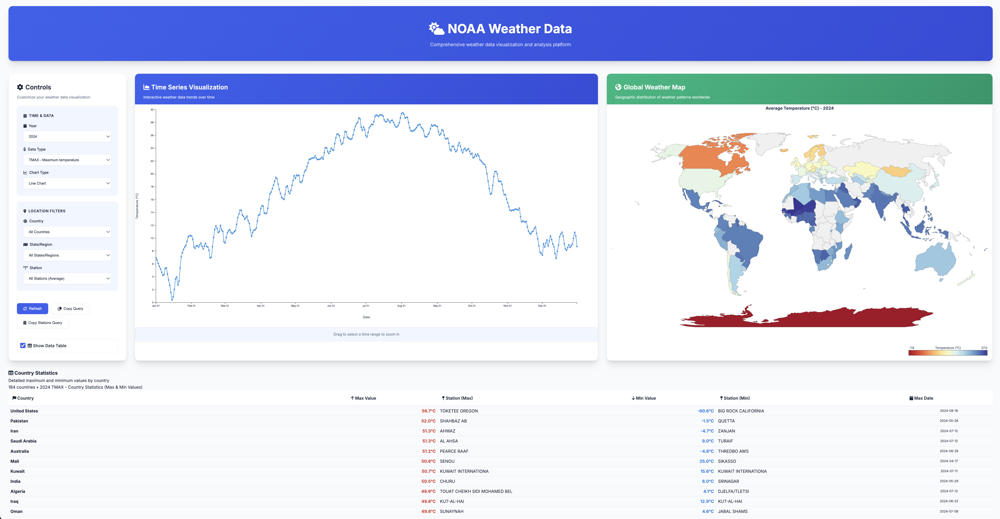

# NOAA Weather Data Visualization

A D3.js-based web application for visualizing NOAA weather data stored in Parquet files using DuckDB for efficient querying.



Data is sourced from [NOAA via AWS S3](https://registry.opendata.aws/noaa-ghcn/). NOAA data disseminated through NODD is made available under the [Creative Commons 1.0 Universal Public Domain Dedication (CC0-1.0) license](https://creativecommons.org/publicdomain/zero/1.0/?ref=chooser-v1%5C), which is well-known and internationally recognized. There are no restrictions on the use of the data. The data are open to the public and can be used as desired.

## Features

- **Interactive Data Visualization**: View weather data through line charts, bar charts, and heat maps
- **Multiple Weather Elements**: Supports Temperature (TMAX, TMIN, TAVG) and Precipitation (PRCP) data
- **Year Selection**: Choose from available years
- **Parquet Querying**: Uses DuckDB to query cached Parquet files, avoiding need to download entire data set ahead of time like with Evidence
- **Responsive Design**: Clean, modern interface that works on different screen sizes

## Prerequisites
- [AWS CLI](https://docs.aws.amazon.com/cli/latest/userguide/getting-started-install.html) - for downloading data from S3
- [Node.js](https://nodejs.org/en/download) (v14 or higher)

## Installation

1. Clone or download this project
2. Install dependencies:
   ```bash
   npm install
   ```
3. Fetch dimensions
   ```bash
   npm run fetch-metadata
   ```

## Usage

1. Start the server:
   ```bash
   npm run dev
   ```

2. Open your browser and navigate to `http://localhost:3001`

3. Use the controls to:
   - Select a year
   - Choose a weather element (Temperature or Precipitation) 
   - Pick a chart type (Line, Bar, or Heat Map)

## Data Structure

The application downloads NOAA weather data as needed and stores it in `data` in the following directory structure:
```
data/by_year/
├── YEAR=2020/
│   ├── ELEMENT=TMAX/
│   ├── ELEMENT=TMIN/
│   ├── ELEMENT=PRCP/
│   └── ...
├── YEAR=2021/
└── ...
```

## Chart Types

- **Line Chart**: Shows daily temperature/precipitation trends over time
- **Bar Chart**: Displays monthly averages 
- **Heat Map**: Provides a calendar view showing values by day and month

## Dependencies

- **D3.js**: Data visualization library
- **DuckDB**: Fast analytical database for querying Parquet files
- **Express.js**: Web server framework

## API Endpoints

- `GET /api/weather/:year/:element`: Returns weather data for the specified year and element

## Development

To run in development mode:
```bash
npm run dev
```

The server will start on port 3000 and serve the static files.